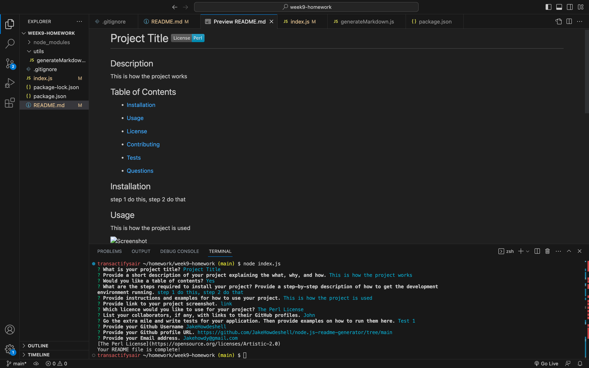

# Node.js README.md Generator

## Description

AS A developer
I WANT a README generator
SO THAT I can quickly create a professional README for a new project
Acceptance Criteria

GIVEN a command-line application that accepts user input
WHEN I am prompted for information about my application repository
THEN a high-quality, professional README.md is generated with the title of my project and sections entitled Description, Table of Contents, Installation, Usage, License, Contributing, Tests, and Questions

WHEN I enter my project title
THEN this is displayed as the title of the README

WHEN I enter a description, installation instructions, usage information, contribution guidelines, and test instructions
THEN this information is added to the sections of the README entitled Description, Installation, Usage, Contributing, and Tests

Using the npm inquirer package an array of object prompts was created that allowed for the answers to be provided through user input or selected from a list of choices. All if the user input that was provided in response to the prompted question was then appended to the README.md file and using the writeToFile function to correctly format the user input data.

WHEN I choose a license for my application from a list of options
THEN a badge for that license is added near the top of the README and a notice is added to the section of the README entitled License that explains which license the application is covered under

The renderLicenseBadge and renderLicenseLink functions were created and then imported to see if the user input from a list matched and if it did would provide the correct formatting to create a badge and link for that specific licensing. This information was then displayed on the file with the name of the licence they are covered under. If it did not match, which means the user seclected 'None' from the list it would return an empty string displaying no content for that section to the file.

WHEN I enter my GitHub username
THEN this is added to the section of the README entitled Questions, with a link to my GitHub profile

This was accomplished by creating a prompt for both pieces of information (the GitHub username and a link to their profile) this information was then pieced together using a format that allowed the username to be a hyperlink to access their profile.

WHEN I enter my email address
THEN this is added to the section of the README entitled Questions, with instructions on how to reach me with additional questions

This was accomplished by using the user input email address as a link using the mailto: format, this allowed the user to draft an email to the provided email address by clicking the hyperlink. The additional instructions were placed as a message to be provided if input was provided by the user.

WHEN I click on the links in the Table of Contents
THEN I am taken to the corresponding section of the README

This was accomplished by formatting the writeToFile function with a # sign before the designated section title name, this created a hyperlink to those locations on the document. If the sections were left empty by the users then they were aknowledged as empty strings and a section was not created for them in the table of contents.

## Table of Contents

- [Installation](#installation)

- [Usage](#usage)

- [Questions](#questions)

## Installation

- Step 1: The user will need to have [Node.js](https://nodejs.org/en/download) installed on their PC or use the link provided to install it.

- Step 2: Before running the program the user will need to install the inquirer package 8.2.4 by typing 'npm install inquirer@8.2.4' into the terminal integrated to the location of the folder holding the program.

- Step 3: The user will run the program by following the example provided in the [Usage](#usage) section.

## Usage

After running "node index.js" on the command line the user is promted with a series of questions that require them to provide an input or select from a list of items to generate a professional grade README.md.

Video Example: https://watch.screencastify.com/v/tEtu0yrcKN5WN15zuQMc

## Questions

Regarding any questions please check out my Github profile [JakeHowdeshell](https://github.com/JakeHowdeshell/node.js-readme-generator/tree/main).

Or send me an [email](mailto:Jakehowdy@gmail.com).
